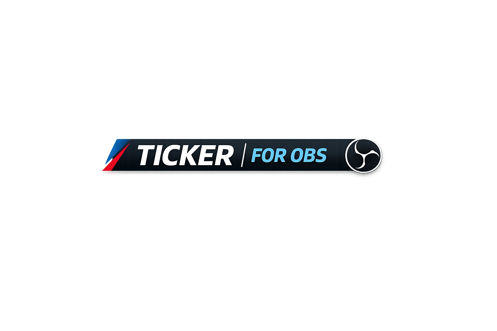

# OBSTicker

OBSTicker is a Laravel + Inertia React app for running a live ticker overlay in OBS. It supports public text submissions, an admin dashboard, RSS feeds, moderators, and a fullscreen public ticker view.

<p align="center">
    
</p>

## Requirements

- PHP 8.3+
- Composer
- Node.js 20+
- SQLite, MySQL, or PostgreSQL

## Setup

```bash
composer install
npm install
cp .env.example .env
php artisan key:generate
php artisan migrate
```

## Development

```bash
composer run dev
```

## Build

```bash
npm run build
```

## Tests

```bash
php artisan test
```

## Main routes

- `/ticker` - fullscreen ticker view
- `/ticker/payload` - JSON payload for the ticker
- `/submit` - public submission page
- `/ticker-admin` - admin dashboard

## Features

- Queue and display admin text
- Accept public text submissions
- Pull and rotate RSS feeds
- Configure animation, colors, layout, and chroma key
- Manage moderators
